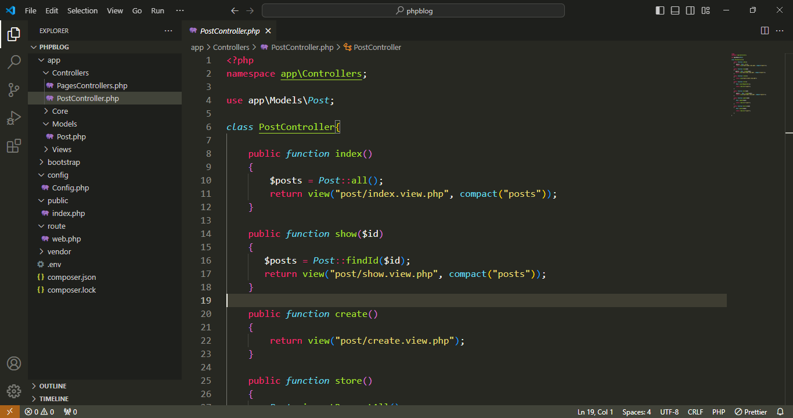
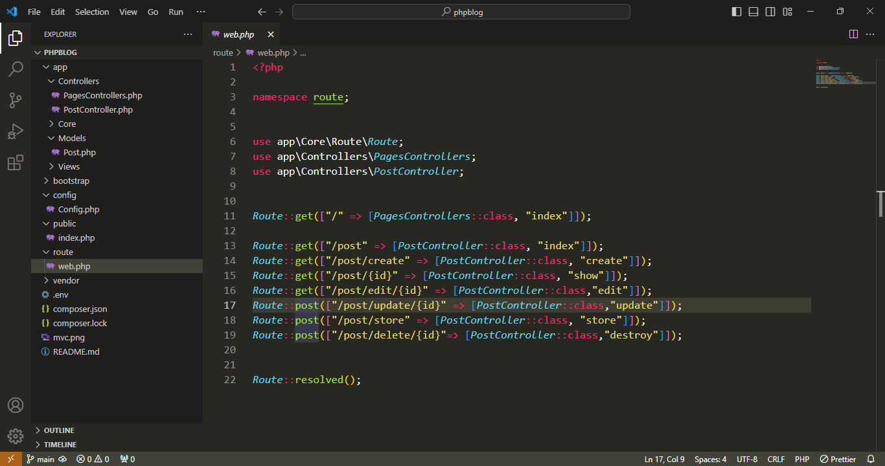

# php-mvc-mini

# controller


# Route



## Deskripsi Paket
Paket `symfony/dotenv` adalah bagian dari ekosistem Symfony dan digunakan untuk mengelola variabel lingkungan dalam proyek PHP. Versi yang digunakan dalam proyek ini adalah ^6.4.

## Composer Autoload
Proyek ini menggunakan Composer untuk mengelola dependensi PHP-nya. File `composer.json` berisi daftar dependensi dan autoload. Untuk memasang dependensi, jalankan perintah `composer install`. Untuk memuat otomatis kelas-kelas dalam proyek, Composer menggunakan autoload yang didefinisikan dalam file `vendor/autoload.php`.

### Menjalankan Proyek

1. Pastikan  PHP sudah  terinstall. Jika belum, silakan download dan instal PHP dari situs resmi [PHP](https://www.php.net/).
   
2. Buka terminal atau command prompt, arahkan ke direktori proyek ini, dan jalankan perintah berikut untuk memuat dependensi menggunakan Composer:
   
   ```bash
   -composer install
   -buat server direktori root public "php -S localhost:8000 -t public"
   -buka alamat localhost:8000
   selesai. note projek ini masi dalam pengembangan 
